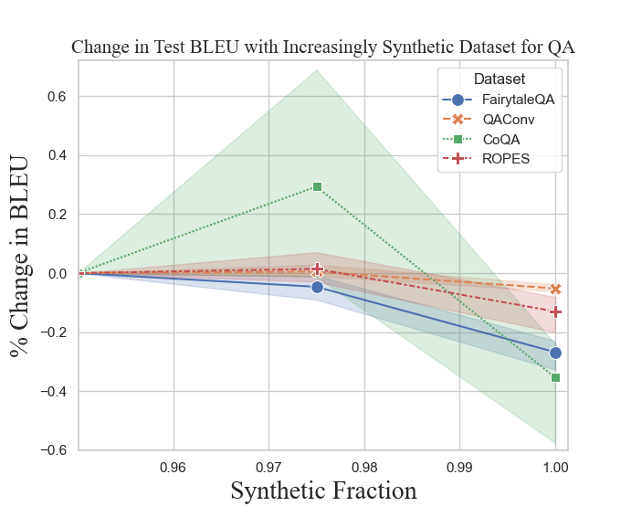
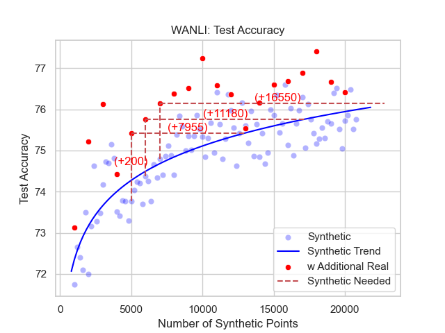

# A Little Human Data Goes A Long Way
 Repository for the work presented in: [A Little Human Data Goes A Long Way]().
 
 The key result of our work is that Fact Verification and Question Answering systems trained on purely synthetic data can be improved if we include minimal amounts of human data during training. 
 
 We show that the performance decline associated with replacing human generated data with synthetic data is most chronic only after crossing 90% replacement.
 
 
 
 Surprisingly, this finding persists until the very end, with the performance drop between 97.5\% and 100\% replacement being significant across all datasets. 
 
 
 
 Finally we study the performance tradeoff implied by the use of purely synthetic data, discovering that the performance boost provided by just 200 human generated can only be matched by an order of magnitude more of synthetic data. 
 
 

See the paper to learn more. 
 
 # Overview
 This repository contains the code required to replicate our experiments, as well as generate synthetic datasets for Fact Verification and Question Answering using only the evidence texts. 
 
 The repository is organized as follows:
 ```
LittleHumanData
    data                 | Directory with data management functions
        explore_data.py  | Print summary statistics on the data
        process_data.py  | Download HF datasets and process all
        split_data.py    | Split the data with controlled synth fraction
    figures              | Directory with sample images from paper
    llm-utils            | Directory with python utility scripts for 
                           training and inference on LLMs
    prompt_generation    | Directory with python scripts for 
                           generating synthetic data
        prompt_models.py | Definition of Prompting Models and template
        gen_dataset.py   | Synthetic data generation functions
    scripts              | bash scripts to run experiments
    add_info_predfile.py | Compute stats on the human v.s. synth data
    analysis.py          | Perform analysis using info_predile
    compute_qa_metrics.py| Compute metrics for QA models
    cot.csv              | Examples used for CoT experiment
    get_data.sh          | Script to load all datasets
    proc_results.py      | Visualize the experiment results from a csv
    proj_params.sh       | Set project wide parameters
    proj_params.yaml     | Set the very same project parameters again
    README.md            | This file
    requirements.txt     | Required python packages and versions
```

# Loading Data and Generating Synthetic Data
Download All Datasets with (you will need to sign up for Factify):

```sh
bash get_data.sh
```

Then process the data with
```sh
python data/process_data.py
```
If you want to add a custom dataset, you can add one in the format given in [process_data.py](data/process_data.py) file

This will save the data files to csvs in $data_dir/generated/$dataset_name/{train, valid, test}.csv

To generate synthetic datasets for them use, 
```sh
python data/gen_dataset.py
```

You will need to set up an OpenAI API Key for this step to work. 

We are working on releasing the synthetic datasets to HuggingFace, and will share the link here once we have.

# Experiments
The configurations and commands for various experiments are found in the scripts folder, see them for the commands required to replicate our results. 

If you use our results or synthetic generation pipeline, please cite our work:
